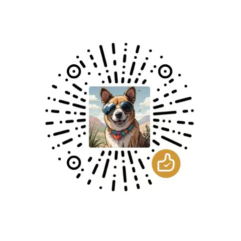

# ikoTheme

[](https://github.com/ikoobee/ikoTheme/actions/workflows/ci.yml)
[](LICENSE)
[](https://astro.build)

**一套「文章 + 项目」双一等公民的 Astro 博客主题。**

English documentation: [README.md](README.md)

为独立开发者与开源作者打造：用一个干净的首页同时展示作品与写作——主内容流
（精选 → 最新文章 → 开源项目 → 动态）+ 右侧伴随栏，暗色模式、归档时间线、
阅读增强，全静态、零默认客户端 JS。

> ✅ **v1.0 已发布**——M1–M4 全部完成（布局、内容集合、全文搜索、评论适配、RSS、每篇文章动态分享图、无障碍走查、Lighthouse CI 门禁），进度以 [README.md](README.md#roadmap) 的 Roadmap 为准。

## 快速开始

环境要求：Node.js 20+（推荐 22）。

```bash
# 模板方式创建：
npm create astro@latest -- --template ikoobee/ikoTheme
# 或克隆本仓库后：
npm install
npm run dev        # http://localhost:4321
```

内容全部放在 `src/content/`：

| 集合 | 路径 | 驱动页面 |
|---|---|---|
| `posts` | `src/content/posts/*.md` | 博客文章（`/posts/<slug>`） |
| `projects` | `src/content/projects/*.md` | 项目展示（`/projects`） |
| `moments` | `src/content/moments/*.md` | 短动态（`/moments`） |
| `friends` | `src/content/friends/*.md` | 友链（`/links`） |

站点身份（名称、作者、导航、签名档……）统一在
[`src/config/site.ts`](src/config/site.ts) 一处配置；评论系统同样在此切换：
内置 **giscus / Waline / Twikoo** 三种适配器，`COMMENTS.provider` 三选一开启
（启用指南见 [docs/comments.md](docs/comments.md)），未启用的适配器不进入客户端
产物，全部懒加载。站内全文搜索（Pagefind）由 `npm run build` 自动生成索引。

```bash
npm run build      # 构建产物到 dist/，并生成 Pagefind 搜索索引
npm run preview    # 本地预览构建产物（可体验搜索/RSS）
npm run check      # astro check（类型 + 内容 schema 校验）
```

## 许可证

[MIT](LICENSE) © 2026 Ethan (ikoobee)

## ☕ Sponsor / 赞赏

如果这个主题帮你更快搭好了博客，欢迎请作者喝杯咖啡 ☕

<details>
<summary>赞赏码 / Donation</summary>


</details>
